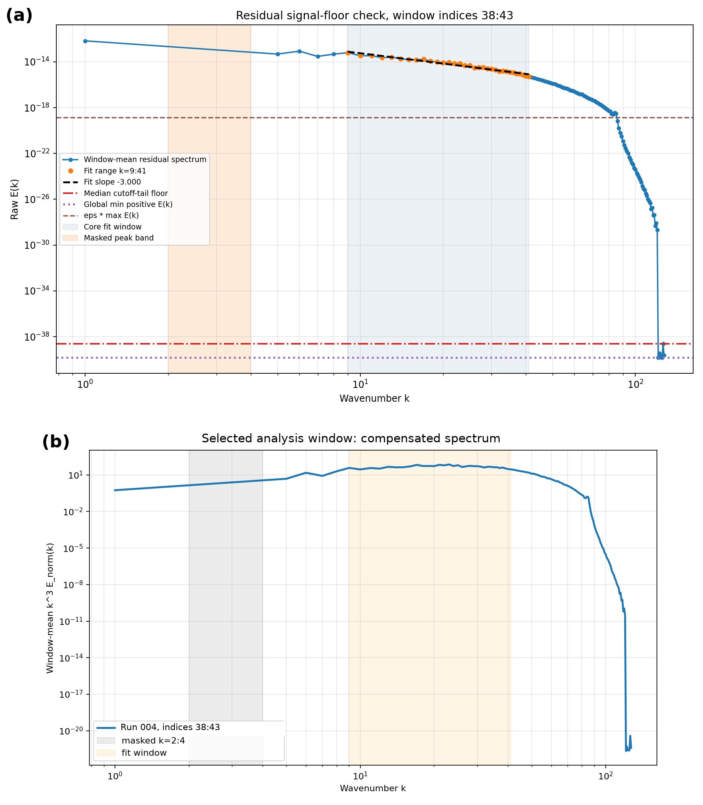
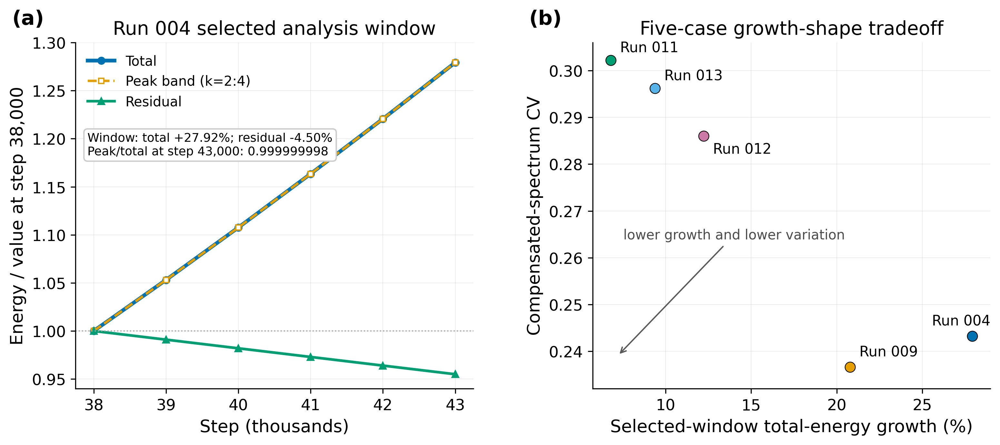
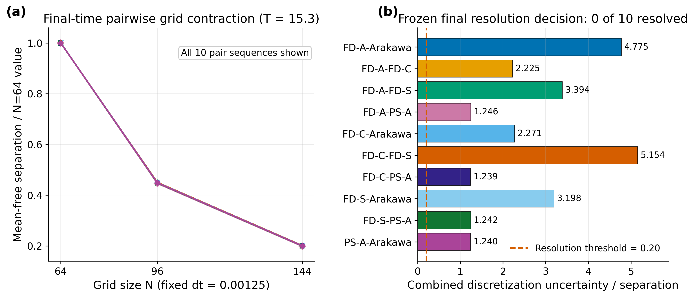

# Residual `k^-3`-Like Spectral Structure, Growth--Shape Tradeoffs, and Numerical Sensitivity in a Forced Two-Dimensional Vorticity Solver

**Raj Sanghera**

Independent Researcher

*Keywords:* two-dimensional vorticity; spectral diagnostics; enstrophy;
numerical verification; grid refinement; advection discretization

## Document status

This is the canonical technical-report manuscript source synchronized through
the Phase 4 manuscript-artwork checkpoint
`098ba417f504a273ff5e0420446be81c181c302e` on branch
`phase4_validation`. The numerical investigation itself closed earlier at
`8fbe94541cf57ef7c2b519ca080f4288207e6c95`.
The completed scientific-manuscript release candidate is preserved at
`b6b0e52378352d579dac59306a1fa3ac737b8239` under annotated tag
`v0.5.63-phase4-manuscript-release-candidate-1`.
The companion numerical evidence was published on Zenodo on July 23, 2026.
The exact deposited version is identified by DOI
[`10.5281/zenodo.21505468`](https://doi.org/10.5281/zenodo.21505468), while
[`10.5281/zenodo.21505467`](https://doi.org/10.5281/zenodo.21505467)
identifies all Zenodo versions. The final repository publication closure is
marked by annotated tag
`v0.5.63-phase4-manuscript-and-evidence-release`.
The intended publication route is a preprint first; journal selection remains
open.

It integrates two related but distinct evidence streams:

1. the archived Run 004–013 residual-spectrum campaign; and
2. the Phase 13 and Stage B–E numerical-verification campaign.

The configurations and scientific questions differ between those streams.
Stage E is therefore numerical-method sensitivity evidence for its frozen
smooth problem, not a direct refinement or convergence test of Runs 004–013.
The primary-literature citation pass is integrated through `references.bib`,
and the frozen three-figure set is embedded from the archived manuscript
artwork. No new numerical result is introduced here.

## Abstract

This report examines two distinct questions in a forced two-dimensional
vorticity solver: whether selected peak-masked spectra exhibit a robust residual
`k^-3`-like shape, and whether the numerical pathways used to produce and
interpret such results show controlled benchmark and refinement behavior.

In the archived production comparison, Run 004 provides the cleanest residual
spectral-shape case over steps `38,000–43,000`. Runs 009, 011, and 013 expose a
tradeoff between residual-shape quality and reduced selected-window energy
growth. The reported shape survives time-window, fit-range, signal-floor,
shell-support, and leave-one-shell-out checks. Nevertheless, the spectra remain strongly
low-wavenumber dominated and the strongest results are peak-masked and
window-local. They do not establish a stationary enstrophy cascade or a
physical `k^-3` law.

A separate verification and sensitivity campaign was conducted under
independently frozen configurations. Phase 13 exact, manufactured, and
exploratory benchmarks separated arithmetic-floor, spatial-error-dominated,
and timestep-error-dominated regimes. Stage B closed an exact implemented
RK2-plus-mask enstrophy ledger. Stage C found mixed, operator-form-dependent
same-state enstrophy work. Stage D1R demonstrated independently owned,
internally consistent alternate trajectories. Stage E then completed 229,500
accepted primary updates across five refinement cases. All five primary
operator families showed essentially second-order temporal self-refinement; the
finite-difference and Arakawa positions showed approximately second-order
spatial self-refinement; and all ten operator-pair separations decreased under
grid refinement, with none resolved against the declared uncertainty rule.

The combined evidence supports a documented residual spectral resemblance in
selected production windows and a truncation-error explanation for the
operator-form separations measured in the separate smooth refinement problem.
It does not provide a validated numerical reference, method ranking, formal
universal convergence result, or physical cascade validation. The numerical
investigation closes at numerical checkpoint `8fbe945`; literature,
manuscript, and artwork integration are synchronized through `098ba41`.

## 1. Research questions and claim boundaries

The production spectral campaign asks:

> Does a residual spectral shape close to `k^-3` remain after masking the
> forcing-scale peak and testing time-window stability, compensated spectra,
> signal floor, shell support, and fit sensitivity?

The later numerical-verification campaign asks:

> Are the implemented solver pathways internally consistent, and do measurable
> advection-form trajectory differences persist after controlled timestep and
> grid refinement?

The first is a spectral-diagnostic question. The second is a code-verification
and numerical-sensitivity question. Neither alone establishes turbulence, a
cascade, an inertial range, or a physical scaling law.

The `-3` reference originates in classical two-dimensional turbulence theory.
Conservation of kinetic energy and mean-square vorticity constrains inviscid
spectral redistribution [@Fjortoft1953], while the Kraichnan--Batchelor
phenomenology associates a direct enstrophy-transfer range with
$E(k) \propto k^{-3}$ [@Kraichnan1967; @Batchelor1969]. The nominal
`k^-3` range is marginally nonlocal and admits a logarithmic correction
[@Kraichnan1971]; limited scale separation therefore complicates asymptotic
interpretation [@Bowman1996]. These theoretical results make `-3` a meaningful
comparison exponent, but they do not turn agreement with that exponent into
evidence of a cascade.

Throughout this report:

- “residual `k^-3`-like” describes a qualified spectral resemblance in selected
  peak-masked windows;
- “reference case” means a descriptive within-set comparison case, not a
  validated numerical truth;
- “unresolved” means that measured separation does not exceed the conservative
  discretization-uncertainty envelope; and
- refinement behavior is reported only for its declared frozen problem and
  measured range.

## 2. Governing equation and numerical configurations

### 2.1 Solver formulation

The solver advances scalar vorticity on a periodic square domain,
$(x,y) \in [0,2\pi)^2$, using

$$
\frac{\partial \omega}{\partial t}
= -\left(u\,\partial_x\omega + v\,\partial_y\omega\right)
  + \nu\nabla^2\omega + f + D_L,
$$

where $D_L$ denotes the optional large-scale drag used only in the listed drag
cases. The implemented streamfunction and velocity sign conventions are

$$
\nabla^2\psi=\omega, \qquad
u=\partial_y\psi, \qquad v=-\partial_x\psi.
$$

Thus the stored scalar uses the sign opposite to the usual
$z$-component curl convention; all reported diagnostics follow the implemented
definition consistently.

The Poisson solve, velocity derivatives, and viscous Laplacian are evaluated
with Fourier transforms. The production baseline evaluates vorticity gradients
with centered finite differences, advances with an explicit two-stage RK2
update, and applies the solver's rectangular two-thirds Fourier mask after the
accepted update. Stage C--E retain this time integration and filtering contract
while substituting the declared nonlinear-advection forms. Discrete kinetic
energy and enstrophy are recorded as
$E=\tfrac12\langle u^2+v^2\rangle$ and
$Z=\tfrac12\langle\omega^2\rangle$; kinetic-energy spectra are radial
shell sums derived from vorticity.

These are implemented numerical definitions rather than a claim that every
discrete form preserves the inviscid continuum invariants. Stage B--E test the
consequences of the actual RK2, forcing, viscosity, and post-step mask.

### 2.2 Archived production spectral cases

The spectral comparison cases used:

| Parameter | Common production value |
|---|---:|
| Grid | `N=256` |
| Timestep | `dt=0.0005` |
| Viscosity | `nu=5e-05` |
| Updates | `50,000` |
| Saved-spectrum spacing | `1,000` updates in the documented windows |

The controlled variations were forcing mode, forcing amplitude, and low-k
selective drag.

### 2.3 Focused Stage E refinement problem

Stage E used a different frozen problem:

| Parameter | Stage E value |
|---|---|
| Domain | periodic `2*pi` square |
| Initial vorticity | exact zero |
| Reynolds number / viscosity | `Re=1000` / `nu=0.001` |
| Forcing | smooth multimode, RMS `0.005` |
| Grids | `N=64`, `96`, `144` |
| Timesteps | `0.005`, `0.0025`, `0.00125` |
| Final time | `T=15.3` |
| Primary trajectories | FD advective, FD conservative, FD skew, pseudo-spectral advective, Arakawa |

The case matrix was L-shaped: timestep refinement was performed at `N=64`,
and spatial refinement used `dt=0.00125`. A complete space–time interaction
matrix was not measured.

## 3. Residual-spectrum diagnostic methodology

The production analysis used a chained diagnostic standard rather than a slope
fit alone.

| Diagnostic | Purpose |
|---|---|
| Candidate slope fit | Identify spectra with a residual exponent near `-3`. |
| Time-window analysis | Test whether the fitted shape persists over nearby saved spectra. |
| Total and peak energy histories | Separate shape persistence from full-system stationarity. |
| Energy partition | Quantify low-k and forcing-peak domination. |
| Peak masking | Test whether the residual shape survives removal of the dominant forcing band. |
| Compensated `k^3 E(k)` spectrum | Examine plateau-like residual behavior. |
| Window sensitivity | Measure dependence on time and fit-range choices. |
| Exponent uncertainty | Report a defensible range rather than a single exact exponent. |
| Signal-floor analysis | Verify that fitted residual values exceed numerical-floor estimates. |
| Shell-support analysis | Check radial-mode population in the fitted range. |
| Leave-one-shell-out analysis | Test whether one shell controls the fit. |

This chain supports cautious residual-shape wording. It cannot replace
stationary budgets or spectral-flux evidence for a cascade claim. More
generally, apparent power-law fits are sensitive to range selection and require
goodness-of-fit and competing-explanation checks [@ClausetEtAl2009]. In forced
two-dimensional turbulence, stronger cascade demonstrations combine
stationarity with signed energy and enstrophy flux diagnostics
[@Boffetta2007; @VallgrenLindborg2011]. The present diagnostic chain does not
claim to reproduce either paper's physical regime or flux analysis.

For each saved shell-summed spectrum $E_n(k)$, the forcing-scale band was set
to missing and the remaining spectrum was normalized by its sum,

$$
E_{n,\mathrm{norm}}(k)
=\frac{M(k)E_n(k)}{\sum_q M(q)E_n(q)},
$$

where $M(k)=0$ in the declared peak mask and $M(k)=1$ elsewhere. Over the
declared fitted shells, ordinary least squares was applied in log--log space,

$$
\log_{10}\overline{E}_{\mathrm{norm}}(k)=a+p\log_{10}k,
$$

with $p$ reported as the residual exponent and the usual coefficient of
determination reported as $R^2$. The compensated diagnostic was
$C(k)=k^3\overline{E}_{\mathrm{norm}}(k)$, and its coefficient of variation was
$\operatorname{sd}(C)/\operatorname{mean}(C)$ over the same fitted shells.
These quantities assess shape only; normalization removes amplitude
information, which was therefore tracked separately through total, peak-band,
and residual-energy histories.

The quoted exponent uncertainty is the empirical spread across the frozen
time-window and fit-range ensemble, not a probabilistic confidence interval.
Signal-floor checks compared fitted-shell values with both the high-wavenumber
tail and machine-epsilon-scaled maximum energy. Shell counts and
leave-one-shell-out fits then tested sampling support and single-bin influence.
No one of these gates independently validates a power law.

## 4. Archived production spectral results

### 4.1 Run 004 residual-shape result

Run 004 is the cleanest residual-shape comparison case in the archived set.

| Field | Value |
|---|---|
| Parameters | `N=256`, `dt=0.0005`, `nu=5e-05`, forcing amplitude `0.01`, forcing mode `2`, no drag |
| Selected window | saved indices `38:43`, steps `38,000:43,000` |
| Fit range / peak mask | `k=9:41` / `k=2:4` |
| Window fit slope / `R^2` | approximately `-3.0004` / `0.9668` |
| Consolidated mean slope / `R^2` | `-3.0036` / `0.9650` |
| Compensated coefficient of variation | `0.2433` |
| Residual exponent uncertainty | approximately `-3.00 +/- 0.15` |
| Leave-one-shell-out slope range | `[-3.0778, -2.9517]` |
| Minimum leave-one-out `R^2` | `0.9631` |
| Minimum / median fitted-shell population | `56 / 160` modes |
| Selected-window total/peak energy growth | approximately `+27.92%` |

The residual shape is well above the recorded numerical floor and is not
controlled by one radial shell. Its key limitation is physical: total and peak
energy continued growing, the residual amplitude was small relative to the
forcing-scale peak, and the full spectrum remained severely low-k dominated.
Figure 1 summarizes both the fitted residual and its compensated form.



*Figure 1. Selected-window residual spectral diagnostics for Run 004.* (a)
Peak-masked window-mean spectrum over saved indices 38--43 (steps
38,000--43,000). Markers identify the fitted shells `k=9:41`, the reference
line shows the fitted exponent near `-3`, and the recorded floor estimates
remain well below the fitted values. The forcing-scale band `k=2:4` is
excluded. (b) The corresponding normalized compensation,
`k^3 E_norm(k)`, shows limited plateau-like behavior over the same interval.
These panels establish a residual spectral resemblance in a selected window;
they do not establish stationarity, an inertial range, or an enstrophy cascade.

### 4.2 Forcing and drag comparisons

| Case | Configuration | Slope | `R^2` | Compensated CV | Window growth | Descriptive interpretation |
|---|---|---:|---:|---:|---:|---|
| Run 004 | mode `2`, no drag | `-3.0036` | `0.9650` | `0.2433` | `+27.92%` | Cleanest residual-shape case; largest selected-window growth. |
| Run 009 | mode `3`, no drag | `-3.0116` | `0.9619` | `0.2366` | `+20.78%` | Cleanest mode-3 no-drag residual shape. |
| Run 011 | mode `3`, `alpha=0.10`, `kmax=5` | `-3.0004` | `0.9448` | `0.3022` | `+6.80%` | Lowest selected-window growth among the listed combined cases; weaker residual quality. |
| Run 012 | mode `3`, `alpha=0.05`, `kmax=5` | `-3.0217` | `0.9504` | `0.2860` | `+12.23%` | Intermediate combined case. |
| Run 013 | mode `3`, `alpha=0.075`, `kmax=5` | `-2.9916` | `0.9466` | `0.2962` | `+9.38%` | Representative balanced compromise within the archived set. |

The comparison exposes a tradeoff: stronger low-k control reduces
total/peak growth but generally weakens residual-shape metrics. Run 013 is not
universally “best”; it is a balanced descriptive case within this limited set.
Further alpha-only tuning was not justified by the archived comparison.
Figure 2 places the growth limitation and the cross-case tradeoff together.



*Figure 2. Physical limitation and growth--shape tradeoff in the archived
production comparison.* (a) Independently normalized Run 004 total and masked
peak-band energies continue to grow through the selected analysis window,
while the residual decreases slightly. The annotation, rather than vertical
separation of the normalized curves, records the near-unity peak-band fraction
at step 43,000. (b) Across the five documented cases, stronger
low-wavenumber control reduces selected-window growth but generally increases
compensated-spectrum variation. Run 011 has the lowest selected-window growth
among the listed combined cases, while Run 013 is a descriptive compromise.
The comparison identifies neither a stationary case nor a universally optimal
configuration.

This tradeoff is physically plausible rather than a neutral post-processing
effect. In finite periodic domains, inverse transfer can accumulate energy in
the lowest modes [@SmithYakhot1994], and the representation and strength of
large-scale drag can alter coherent structures, budgets, and spectral slopes
[@SukorianskyEtAl1999; @TsangYoung2009]. Those prior results motivate the drag
comparison; they do not establish that any drag choice here is physically
optimal or stationary.

## 5. Numerical-verification methodology

The verification campaign progressively separated implementation correctness,
same-state operator behavior, independent-trajectory behavior, and refinement.

| Evidence stage | Frozen question |
|---|---|
| Phase 13 | Do exact and manufactured benchmarks expose arithmetic-floor, spatial, and temporal error regimes as expected? |
| Stage B | Which implemented term closes the baseline RK2-plus-mask enstrophy ledger? |
| Stage C | How does discrete advection work change with operator form on identical current and RK2-stage states? |
| Stage D1R | Can every frozen form advance a separately owned trajectory with exact baseline reproduction and integrity controls? |
| Stage E | Do the resulting trajectory differences persist under focused timestep and grid refinement? |

Projected variants were reduced to sparse same-state controls in Stage E rather
than being advanced as four additional production paths.

Stage E retained full fields at seven anchors from $t=0$ to $15.3$. For a
field $\omega$, comparisons used the mean-free RMS norm

$$
\lVert\omega\rVert_{\mathrm{mf}}
=\left\langle(\omega-\langle\omega\rangle)^2\right\rangle^{1/2}.
$$

Temporal increments were same-operator differences on the common `N=64` grid,
with

$$
p_t=\frac{\log(E_{t,\mathrm{coarse}}/E_{t,\mathrm{fine}})}{\log 2}.
$$

For spatial comparisons, the `N=96` and `N=144` fields were Fourier-restricted
to a common `N=64` representation using explicit FFT normalization, integer
wavenumber mapping, and zeroed ambiguous even-grid Nyquist axes. The reported
order was

$$
p_x=\frac{\log(E_{x,\mathrm{coarse}}/E_{x,\mathrm{fine}})}{\log 1.5}.
$$

An order was reportable only when both increments exceeded 100 times the
measured numerical floor. For operator pair $i,j$, the conservative
discretization uncertainty was the sum of both operators' fine temporal and
fine spatial increments. A pair was called resolved only when that sum was at
most 20% of the finest-grid common-band mean-free separation at the final
anchor and at least four of the final five anchors. This rule is a declared
resolution test, not a confidence interval or an accuracy ranking.

## 6. Verification and numerical-sensitivity results

### 6.1 Phase 13 foundation

Phase 13 completed an independently audited 10-case pilot followed by 77 finite
exploratory benchmark cases. The matrix separated floating-point-floor,
spatial-error-dominated, and timestep-error-dominated regimes. Manufactured
solutions are a code-verification device rather than physical validation
[@Roache2002]. Accordingly, Phase 13 closed at the exploratory verification and
calibration-evidence level. The deferred full 390-file audit and formal Phase
13H convergence program were not completed and are not silently implied here.

### 6.2 Stage B exact ledger

Stage B closed an exact implemented RK2-plus-mask enstrophy ledger for 20,001
updates. Discrete advection dominated the three omitted
non-forcing/non-viscous terms: advection work, the RK2 quadratic remainder, and
the post-step mask contribution.

This does not mean advection dominated the complete forcing-viscosity budget.
In the final Stage B window, viscous removal exceeded forcing plus positive
discrete-advection input, and accepted-state enstrophy declined at every
recorded step. The baseline was **not stationary within the tested duration**.

### 6.3 Stage C same-state operator behavior

On identical baseline current and RK2-stage states, centered conservative work
retained the baseline magnitude with opposite sign. Centered skew,
real-compatible pseudo-spectral, and Arakawa work were near-neutral. This
established mixed form dependence on the frozen baseline states, not accuracy
or alternate-trajectory behavior.

The Arakawa position is historically motivated by a conservation-designed
discrete Jacobian [@Arakawa1966]. That construction does not imply conservation
for the present forced, viscous, filtered RK2 trajectory, and the Stage C result
is therefore reported only for the implemented same-state comparison.

### 6.4 Stage D1R independent trajectories

The remediated D1 pilot advanced seven independently owned trajectories for
3,060 updates each through `T=15.3`. It reproduced all 3,060 required baseline
rows and recorded zero integrity, shared-memory, or order-invariance failures.
The result established implementation integrity; it did not rank trajectories
or establish convergence.

An earlier D1 implementation stopped before its first accepted update because
of a bookkeeping-definition mismatch and supplied no scientific result; the
archived diagnosis records its remediation without threshold relaxation.

### 6.5 Stage E focused refinement

Stage E completed five cases, 25 case--trajectory realizations, and 229,500 accepted
updates. Its independent evidence audit verified the expected row counts, 175
checkpoint arrays, and zero integrity, ownership, mutation, aliasing, or
finite-value failures.

All five primary operator families showed essentially second-order temporal self-refinement
at every positive-time anchor. At `T=15.3`, observed temporal orders ranged
from `1.997998` to `2.000092`.

The final finite-difference/Arakawa spatial results were:

| Trajectory | Fine spatial increment | Observed `p_x` |
|---|---:|---:|
| FD advective | `5.37055e-5` | `1.98592` |
| FD conservative | `1.23811e-4` | `1.96083` |
| FD skew | `8.17261e-5` | `1.96996` |
| Arakawa | `5.97500e-5` | `1.96419` |

The pseudo-spectral spatial increment fell from `2.86892e-8` to
`6.05372e-12`. Much of that sequence approached the measured numerical floor,
so its large formal ratio is not reported as a physical convergence order.

Every one of the ten operator-pair separations decreased monotonically under
grid refinement. At `N=144`, final separations were approximately
`0.1987–0.2015` of their `N=64` values. Nevertheless, no pair satisfied the
frozen resolution condition:

- `0 / 70` pair-anchor records were resolved overall;
- `0 / 60` positive-time records were resolved; and
- final uncertainty/separation ranged from `1.239` to `5.154`, versus the
  required maximum of `0.20`.

Figure 3 shows the contraction and the unresolved final comparison together.



*Figure 3. Grid contraction and unresolved operator-pair differences in the
separate Stage E smooth problem.* (a) Every final-time pairwise separation
decreases with grid refinement; at `N=144`, the ten separations are
approximately `0.1987--0.2015` of their `N=64` values. (b) Nevertheless, all
final uncertainty-to-separation ratios exceed the frozen resolution threshold
of `0.20` (`1.239--5.154` observed), so none of the ten pairs is resolved. The
finite-grid differences are measurable, but these results establish neither
distinct nor identical continuum limits and do not rank the methods. Stage E
uses a separate smooth, L-shaped refinement problem and is not a refinement
test of Runs 004--013. Trajectory abbreviations: FD-A, finite-difference
advective; FD-C, finite-difference conservative; FD-S, finite-difference
skew-symmetric; PS-A, pseudo-spectral advective; Arakawa, Arakawa Jacobian
trajectory.

The finite-grid differences are measurable and are not called zero. Their grid
decay and unresolved status support a truncation-error explanation within the
tested range rather than resolved persistent continuum separation.

Systematic grid-refinement reporting normally distinguishes observed order,
estimated discretization uncertainty, and the assumptions behind an
asymptotic-range interpretation [@CelikEtAl2008]. Stage E followed its own
predeclared conservative uncertainty rule; it was not a formal Grid Convergence
Index calculation and does not claim compliance with that procedure.

All 60 sampled post-filter accepted-update projection previews passed, with a
maximum normalized effect of `2.16405e-13`. Raw same-state transport projection
was not uniformly negligible: 22 of 70 rows failed the descriptive rule. The
accepted-step sparse controls were sufficient for the trajectory question, but
projection cannot be declared irrelevant in general.

## 7. Integrated interpretation

Two findings coexist without being conflated.

First, selected production runs contain a peak-masked residual spectral shape
that remains close to `k^-3` across the documented window-sensitivity,
signal-floor, shell-support, and leave-one-shell-out checks. Run 004 remains the
cleanest residual-shape case, Run 011 the lowest selected-window-growth case
among the listed combined configurations, and Run 013 a balanced compromise
within that parameter comparison.

Prior stationary high-resolution studies demonstrate why this distinction
matters: cascade evidence is materially stronger when spectral shape is paired
with signed fluxes and controlled forcing--dissipation balances
[@Boffetta2007; @VallgrenLindborg2011]. Those diagnostics were not established
for Runs 004--013.

Second, the separate verification campaign shows that discrete advection work
is operator-form dependent at fixed resolution, but that the independently
advanced trajectory differences measured in the smooth Stage E problem
contract approximately as spatial truncation error and remain unresolved
against the declared uncertainty envelope. This strengthens confidence in the
tested implementation pathways and explains the observed finite-grid
sensitivity. It does not directly prove convergence of the Run 004–013 spectra
or convert their residual spectral resemblance into evidence of a physical
cascade.

The strongest combined conclusion is diagnostic rather than universal: the
archived production data support a robust residual `k^-3`-like shape in
selected windows, while full-system stationarity, a cascade, and a physical
spectral law remain unestablished.

## 8. Limitations and non-claims

- Runs 004–013 were not subjected to the focused grid-and-timestep matrix used
  in Stage E.
- Stage E used a smooth forced problem at `Re=1000` through `T=15.3` and an
  L-shaped refinement matrix, not a complete space–time interaction study.
- Stage E measured self-refinement increments rather than error against an
  exact or independently validated reference solution.
- Its summed discretization-uncertainty rule is a conservative project-specific
  resolution criterion, not a statistical confidence interval or a formal
  Grid Convergence Index.
- Phase 13 closed at the exploratory verification level rather than producing
  formal solver-wide convergence or physical validation.
- No validated reference solution or accuracy ranking exists.
- The production spectra remain severely low-wavenumber dominated, with peak
  fractions close to one.
- The strongest spectral evidence is residual, peak-masked, and window-local.
- No archived result establishes global stationarity, turbulence, an inertial
  range, an enstrophy cascade, or a physical `k^-3` law.
- The conclusions do not generalize beyond the respective frozen
  configurations.

The evidence is consistent with a common-continuum truncation-error explanation
for the Stage E trajectories over the measured range. It does not prove that
the methods converge to the same exact solution, that their differences vanish,
or that any method is superior.

## 9. Reproducibility, provenance, and availability

### 9.1 Versioned evidence

The public repository is
<https://github.com/rajsanghera559-cpu/Raj-Sanghera-Project> on branch
`phase4_validation`. No numerical solve was performed during manuscript
preparation. Numerical conclusions close at commit
`8fbe94541cf57ef7c2b519ca080f4288207e6c95`; figure selection is bound to
`9b1b4eb981982178815bf6387e9edd2e8a1182b5`; and the approved eight-file artwork
set is present at manuscript-artwork checkpoint
`098ba417f504a273ff5e0420446be81c181c302e`.

The canonical numerical-evidence chain comprises
`PHASE13_EXPLORATORY_NUMERICAL_RESULTS_AND_CLOSURE.md`,
`STAGE_B_EXACT_OPERATOR_LEDGER_EVIDENCE_REPORT.md`,
`STAGE_C_REMEDIATED_FULL_SAME_STATE_SHADOW_AUDIT_COMPLETION_REPORT.md`,
`STAGE_D1_REMEDIATED_SEPARATE_TRAJECTORY_PILOT_COMPLETION_REPORT.md`,
`STAGE_E_FOCUSED_REFINEMENT_STUDY_COMPLETION_REPORT.md`, and
`FINAL_NUMERICAL_INVESTIGATION_SCIENTIFIC_SYNTHESIS_AND_CLOSURE.md`. The D1R
and Stage E completion reports identify, respectively, inventory SHA-256 values
`B71EF5D9313B1C3FAE007726C92F77F7C0CD17B26D2A27F7841F073BECD8BE20` and
`D5DA8930A9F16FE444C49C7186F15F54531076DD0376D1696140490D93CF181A`.
The Stage E evidence-package SHA-256 is
`BD8203EE98B752D74657D20FF7938E28367828D7AE4047B1BDDE29E45C64BCEA`.
The D1R evidence-package SHA-256 is
`703A7E012ED32A3286E5D75B37B437954A33C811B088CA7CF8D0B746543C1357`.
The reports retain the corresponding runner commits, run identifiers, row
contracts, and claim boundaries rather than duplicating full inventories here.
`PHASE4_EVIDENCE_MANIFEST.json` binds these archive identities to their
internal inventories and completion reports. The exact published companion
record is identified by Zenodo DOI
[`10.5281/zenodo.21505468`](https://doi.org/10.5281/zenodo.21505468).
The all-versions DOI
[`10.5281/zenodo.21505467`](https://doi.org/10.5281/zenodo.21505467)
resolves to the latest Zenodo version.

### 9.2 Figure regeneration

The frozen selection is recorded in `MANUSCRIPT_FIGURE_SELECTION.md`. The
renderer is `render_phase4_manuscript_figures.py`, and the approved output is
`manuscript_figures/phase4_checkpoint_9b1b4eb_qa_revision1`. After restoring
the archived Stage E bundle at the path named in its completion report, the
read-only check and presentation-only render commands are:

```text
python -B render_phase4_manuscript_figures.py inspect
python -B render_phase4_manuscript_figures.py render --output-dir <new-directory>
```

The renderer imports no project solver code and advances no numerical state.
Figure 1 recomposes two immutable diagnostic PNGs because the corresponding
raw Run 004 spectral arrays and a dedicated original generator are not present
in the current checkout; it does not reconstruct or refit curves. Figures 2
and 3 are rendered from archived tabular evidence. Binary artwork identities
are raw-byte SHA-256 values; tracked text identities are normalized to LF in
the portable figure inventory.

### 9.3 Reproduction boundary and data availability

Stage B and Stage C raw evidence is tracked in the repository. Several older
production inputs and the D1R and Stage E evidence bundles are excluded by the
repository's generated-data policy and are not present in a clean clone.
Consequently, the current repository supports inspection of the completion
reports and committed artwork, but a complete independent row-level audit or
figure regeneration additionally requires the hash-identified companion
evidence packages published as the exact Zenodo version
[`10.5281/zenodo.21505468`](https://doi.org/10.5281/zenodo.21505468).

Archived Stage B and Stage C metadata record Windows 11, CPython 3.14.5,
NumPy 2.4.4, and `float64`. The later D1R and Stage E metadata do not preserve a
complete software environment. The present-day publication and artifact-
inspection environment was captured as Windows 11, CPython 3.14.5, NumPy
2.4.4, pandas 3.0.3, Matplotlib 3.10.9, and Pillow 12.2.0, with package versions
pinned in `requirements-publication.txt`. `REPRODUCTION_ENVIRONMENT.md`
separates this present-day record from the unavailable historical D1R and
Stage E environments. The historical numerical runners are repository-state-
bound and should be used only at their recorded execution checkpoints with
their prerequisite evidence. Exact cross-platform rerun equivalence is
therefore not claimed. The published Zenodo record supplies the two companion
data bundles, their completion reports, and the machine-readable evidence
manifest. The environment record, package pin, manuscript, and inspection
tools remain versioned in the repository at the final release tag.

This artifact-centered reporting follows the principle that computational
results should retain traceable inputs, code, intermediate evidence, and
versioned provenance [@SandveEtAl2013]. The citation supports the reporting
practice, not the scientific validity of the solver or spectra. External
literature supplies context and methodology; every project-specific numerical
value is sourced to the repository evidence chain.

## 10. Conclusions and future scope

The production evidence supports a peak-masked residual spectral resemblance
near `k^-3` in selected windows, most cleanly for Run 004. Growth of the total
and forcing-scale energy, severe peak domination, limited scale separation,
and absent flux evidence preclude a claim of full stationarity, an inertial
range, or an enstrophy cascade.

The separate Stage E smooth problem shows essentially second-order temporal
self-refinement for all five operator families, approximately second-order
spatial self-refinement for the finite-difference and Arakawa families, and
near-floor pseudo-spectral spatial increments. Every operator-pair separation
contracts under grid refinement, but none is resolved against the frozen
uncertainty rule. This supports a truncation-error explanation over the tested
range without proving a common exact limit or ranking methods.

The numerical investigation is closed at checkpoint `8fbe945`; manuscript and
artwork integration is current through `098ba41`; and the companion evidence
is published at DOI
[`10.5281/zenodo.21505468`](https://doi.org/10.5281/zenodo.21505468).
No same-grid Stage D2 run, automatic `N=216` escalation, or further numerical
audit is warranted for the closed operator-persistence question. A future
accuracy-ranking study would require a separately validated reference
candidate. A future physical-cascade claim would instead require
production-configuration refinement, stationary budgets and signed fluxes,
and suitable long-time or ensemble analysis. These are distinct new
objectives, not unfinished Phase 4 work.

## Author declarations

### Funding

This research received no external funding.

### Acknowledgments

The author has no additional acknowledgments.

### Competing interests

The author declares no competing interests.

### Author contributions

Raj Sanghera: Conceptualization, Methodology, Software, Validation, Formal
analysis, Investigation, Data curation, Visualization, Writing--original
draft, Writing--review and editing, and Project administration.

### AI-assisted work

Generative AI tools assisted with software development, documentation,
evidence organization, and editorial preparation. The author reviewed and
verified the analysis, citations, numerical evidence, and final text and
accepts full responsibility for the work.

### Licensing

Repository code authored for this project is licensed under the MIT License.
The manuscript, project-authored figures and documentation, and released
evidence datasets are licensed under the Creative Commons Attribution 4.0
International License, except where third-party rights are identified.

## References

::: {#refs}
:::
